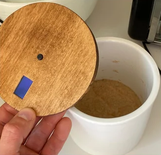
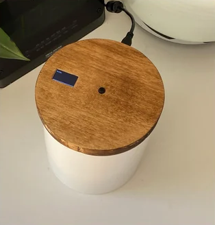
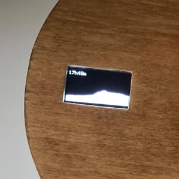

# Panometer

A sourdough starter monitor. A distance sensor measures how much the starter has risen and plots its growth over time on a small OLED display embedded in a wooden lid sitting on top of the jar. Prototyped on a Raspberry Pi in Common Lisp, then rewritten in C and compressed onto an Arduino.

<p align="center">
  
  
  
</p>

## Arduino

### Schematic

### Setup
```
# install arduino-cli
curl -fsSL https://raw.githubusercontent.com/arduino/arduino-cli/master/install.sh | sh

# install core for nano
arduino-cli core update-index
arduino-cli core install arduino:avr

# compile and upload
make
make upload # or upload_old depending on the version of the bootloader
```

### TODO
* Add hour markings on the graph
* Screen refresh rate slows down with increasing number of samples - investigate and optimize


## Raspberry Pi Zero

### Schematic

### Setup

* Download and install [Raspbian Stretch Lite](https://raspberrypi.org/downloads/raspbian)

* Enable SSH
```
touch /Volumes/boot/ssh
```

* Enable and configure WiFi
```
country=US
ctrl_interface=DIR=/var/run/wpa_supplicant GROUP=netdev
update_config=1

network={
  ssid="my SSID"
  psk="my password"
}
```

* [Install DHT11 driver](https://github.com/adafruit/Adafruit_Python_DHT)
* Install Python 3
```
sudo apt-get install python3
```

* [Install vl6180 driver](https://learn.adafruit.com/adafruit-vl6180x-time-of-flight-micro-lidar-distance-sensor-breakout/python-circuitpython)
* Enable I2C
```
sudo raspi-config
```

* Install Common Lisp (Clozure - armcl)
```
sudo apt-get install libiw-dev armcl
```

* Set up a daemon
```
cp panometer.service /etc/systemd/system/
sudo systemctl enable /etc/systemd/system/panometer.service
sudo systemctl start panometer.service
```
